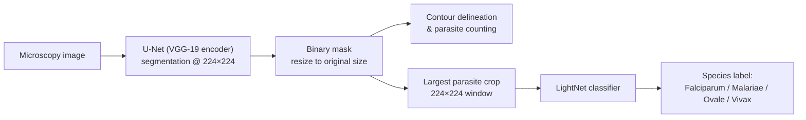

# 🦠 Malaria Parasite Detection & Species Classification

A deep-learning pipeline for **automated malaria diagnosis** from microscopy images: it segments *Plasmodium* parasites in thick blood smears, counts infections per image, extracts individual parasite crops, and classifies each parasite into one of four species — **Falciparum, Malariae, Ovale, Vivax**.

This project was developed as part of a **Master's thesis** in medical image analysis.

## ✨ Features

- **Parasite segmentation** — U-Net with a VGG-19 encoder produces per-pixel binary masks of parasites.
- **Parasite counting** — Contour analysis of the predicted masks yields the number of parasites detected in each image.
- **Contour delineation** — Detected parasites are outlined on the original image; the count is embedded in the output filename.
- **Largest-parasite cropping** — A 224×224 window is placed around the largest parasite per image using smart boundary-aware positioning (9 candidate positions).
- **Species classification** — A lightweight CNN (LightNet) classifies each parasite crop into one of the four *Plasmodium* species.

## 🔬 Pipeline Overview



## 🧰 Tech Stack

- **Python 3**
- **TensorFlow / Keras** — model training and inference
- [**segmentation_models**](https://github.com/qubvel/segmentation_models) — U-Net + VGG-19 encoder
- **OpenCV (cv2)** — mask post-processing, contour analysis, cropping
- **NumPy / tqdm** — array operations and progress tracking

## 📋 Requirements

Install dependencies with:

```bash
pip install tensorflow segmentation-models opencv-python numpy tqdm matplotlib
```

> **GPU (optional):** control CUDA device selection by uncommenting the cell header:
> ```python
> import os
> os.environ["CUDA_DEVICE_ORDER"] = "PCI_BUS_ID"
> os.environ["CUDA_VISIBLE_DEVICES"] = "2"
> ```

## 🚀 Usage

The pipeline consists of five sequential stages. Update the dataset paths (`E:/malaria_data/...`) and model weight files to match your local setup before running.

### 1. Parasite Segmentation (Binary Mask Generation)

Loads the trained U-Net (`vgg19_color_ntl_dataset12_shuffle_nocrops_augmented.hdf5`) and generates binary masks for all test images.

- Input: RGB image, resized to **224×224**, normalized (sample-wise centering + std scaling).
- Output: binary mask (`result > 0.5 → 255 else 0`).
- Loss: **Binary Cross-Entropy + Jaccard** · Metric: **IoU score** · Optimizer: Adam (lr = 1e-4).

### 2. Mask Resize to Original Resolution

Predicted 224×224 masks are upsampled back to the original image dimensions and re-thresholded (127) to stay binary. Set `new_w`/`new_h` for your dataset (e.g. 1382×1030).

### 3. Contour Delineation & Counting

External contours are extracted from each mask (`cv2.RETR_EXTERNAL`), drawn on the original image, and the parasite count is appended to the output filename:

```
<image_name>_<N>_parasites.png
```

### 4. Largest-Parasite Cropping

For each image, the parasite with the largest bounding box is cropped within a **224×224** window. The window is centered on the bounding box, and if it falls outside image boundaries the code tries 8 fallback positions (up/down/left/right + corners). Images with no detected parasites are logged to a report list.

### 5. Species Classification

Each crop is passed through the trained classifier (`LightNet_classification_mixed.hdf5`) and assigned the most probable species:

```
Trip 017 Day 1 19-10-05 Image 14 add_4.png  [Falciparum]
Trip 053 Day 2 19-11-05 Image 1_7.png      [Vivax]
...
```

Class order: `['Falciparum', 'Malariae', 'Ovale', 'Vivax']` · Loss: categorical cross-entropy · Metric: accuracy.

## 📁 Project Structure

```
.
├── notebooks/                # Pipeline stages (segmentation → classification)
├── models/
│   ├── vgg19_color_ntl_dataset12_shuffle_nocrops_augmented.hdf5   # U-Net weights
│   └── LightNet_classification_mixed.hdf5                        # Classifier weights
├── data/
│   └── dataset_2/
│       ├── test/
│       │   ├── img/          # Original microscopy images
│       │   ├── predict/      # Predicted masks (original resolution)
│       │   ├── contours/     # Images with parasite contours + counts
│       │   └── crops/        # 224×224 largest-parasite crops
```

## 📊 Results

- Segmentation inference: **124 test images** processed (~11 s on GPU).
- Contour delineation: all images processed with per-image parasite counts.
- Classification: crops from all infected images assigned a *Plasmodium* species; the vast majority predicted **Falciparum**, consistent with the ground truth of the test set, with a small number of **Vivax** predictions.

## 📝 Notes

- Masks are thresholded at **0.5** (segmentation) and **127** (binary re-thresholding) throughout the pipeline.
- Images with no detected parasite are reported explicitly rather than silently skipped.
- The classifier expects the same preprocessing as the segmentation model: 224×224 resize, sample-wise normalization.

## 📄 License

This project is licensed under the MIT License — see the [LICENSE](LICENSE) file for details.

## 🙏 Acknowledgements

- [segmentation_models](https://github.com/qubvel/segmentation_models) by Pavel Yakubovskiy.
- Dataset: malaria microscopy image collections used for master's thesis research.
